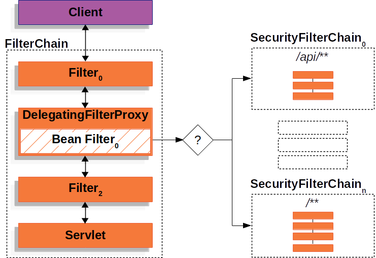
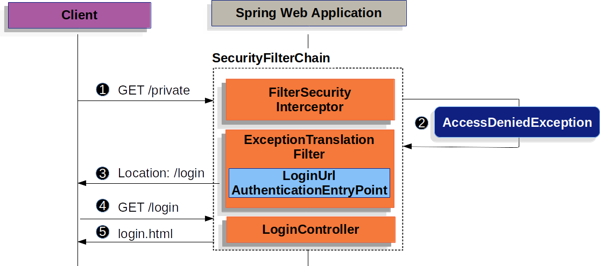
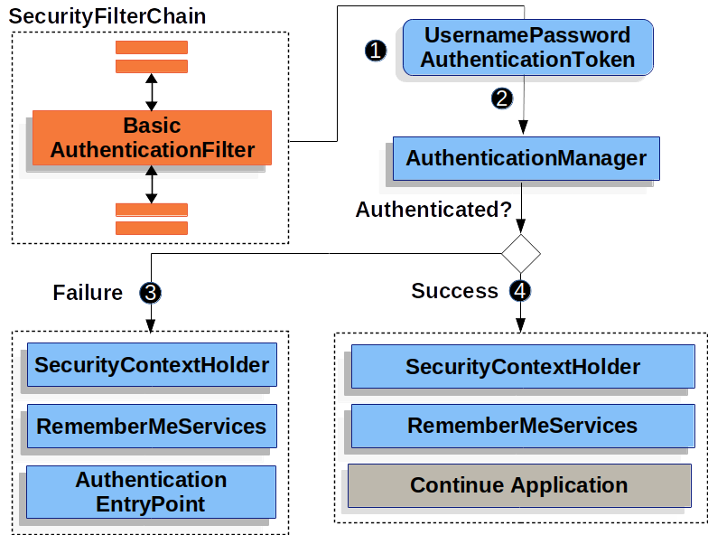

# Servlet Applications

Spring Security integrates with the Servlet Container by using a standard Servlet Filter. This means it works with any application that runs in a Servlet Container. More concretely, you do not need to use Spring in your Servlet-based application to take advantage of Spring Security.

## Spring Boot Auto Configuration

The only step you need to do is update the dependencies

```
<dependencies>
    <!-- ... other dependency elements ... -->
    <dependency>
        <groupId>org.springframework.boot</groupId>
        <artifactId>spring-boot-starter-security</artifactId>
    </dependency>
</dependencies>
```
You can now run the Spring Boot application.


Spring Boot automatically:

* Enables Spring Security’s default configuration, which creates a servlet Filter as a bean named ** springSecurityFilterChain **. This bean is responsible for all the security (protecting the application URLs, validating submitted username and passwords, redirecting to the log in form, and so on) within your application.

* Creates a UserDetailsService bean with a username of user and a randomly generated password that is logged to the console.

* Registers the Filter with a bean named springSecurityFilterChain with the Servlet container for every request.

Spring Security’s Servlet support is based on Servlet Filters,


The client sends a request to the application, and the container creates a FilterChain which contains the Filters and Servlet that should process the HttpServletRequest based on the path of the request URI. In a Spring MVC application the Servlet is an instance of DispatcherServlet. 


The power of the Filter comes from the FilterChain that is passed into it.

```
public void doFilter(ServletRequest request, ServletResponse response, FilterChain chain) {
    // do something before the rest of the application
    chain.doFilter(request, response); // invoke the rest of the application
    // do something after the rest of the application
}
```

# DelegatingFilterProxy

Spring provides a Filter implementation named DelegatingFilterProxy that allows bridging between the Servlet container’s lifecycle and Spring’s ApplicationContext. The Servlet container allows registering Filters using its own standards, but it is not aware of Spring defined Beans. DelegatingFilterProxy can be registered via standard Servlet container mechanisms, but delegate all the work to a Spring Bean that implements Filter.


Here is a picture of how DelegatingFilterProxy fits into the Filters and the FilterChain.


```
public void doFilter(ServletRequest request, ServletResponse response, FilterChain chain) {
    // Lazily get Filter that was registered as a Spring Bean
    // For the example in DelegatingFilterProxy delegate is an instance of Bean Filter0
    Filter delegate = getFilterBean(someBeanName);
    // delegate work to the Spring Bean
    delegate.doFilter(request, response);
}
```

# FilterChainProxy

Spring Security’s Servlet support is contained within FilterChainProxy. FilterChainProxy is a special Filter provided by Spring Security that allows delegating to many Filter instances through SecurityFilterChain.


# SecurityFilterChain
SecurityFilterChain is used by FilterChainProxy to determine which Spring Security Filters should be invoked for this request.


The Security Filters in SecurityFilterChain are typically Beans, but they are registered with FilterChainProxy instead of DelegatingFilterProxy. FilterChainProxy provides a number of advantages to registering directly with the Servlet container or DelegatingFilterProxy. First, it provides a starting point for all of Spring Security’s Servlet support. For that reason, if you are attempting to troubleshoot Spring Security’s Servlet support, adding a debug point in FilterChainProxy is a great place to start.

Second, since FilterChainProxy is central to Spring Security usage it can perform tasks that are not viewed as optional. For example, it clears out the SecurityContext to avoid memory leaks. It also applies Spring Security’s HttpFirewall to protect applications against certain types of attacks.

In addition, it provides more flexibility in determining when a SecurityFilterChain should be invoked. In a Servlet container, Filters are invoked based upon the URL alone. However, FilterChainProxy can determine invocation based upon anything in the HttpServletRequest by leveraging the RequestMatcher interface.





In the Multiple SecurityFilterChain Figure FilterChainProxy decides which SecurityFilterChain should be used. Only the first SecurityFilterChain that matches will be invoked. If a URL of /api/messages/ is requested, it will first match on SecurityFilterChain0's pattern of /api/**, so only SecurityFilterChain0 will be invoked even though it also matches on SecurityFilterChainn. If a URL of /messages/ is requested, it will not match on SecurityFilterChain0's pattern of /api/**, so FilterChainProxy will continue trying each SecurityFilterChain. Assuming that no other, SecurityFilterChain instances match SecurityFilterChainn will be invoked.

Notice that SecurityFilterChain0 has only three security Filters instances configured. However, SecurityFilterChainn has four security Filters configured. It is important to note that each SecurityFilterChain can be unique and configured in isolation. In fact, a SecurityFilterChain might have zero security Filters if the application wants Spring Security to ignore certain requests.


The Security Filters are inserted into the FilterChainProxy with the SecurityFilterChain API. The order of Filters matters. It is typically not necessary to know the ordering of Spring Security’s Filters.

# Handling Security Exceptions


The ExceptionTranslationFilter allows translation of AccessDeniedException and AuthenticationException into HTTP responses.

ExceptionTranslationFilter is inserted into the FilterChainProxy as one of the Security Filters.


* 1 First, the ExceptionTranslationFilter invokes FilterChain.doFilter(request, response) to invoke the rest of the application.

* 2 If the user is not authenticated or it is an AuthenticationException, then Start Authentication.

    *The SecurityContextHolder is cleared out

    *The HttpServletRequest is saved in the RequestCache. When the user successfully authenticates, the RequestCache is used to replay the original request.

    *The AuthenticationEntryPoint is used to request credentials from the client. For example, it might redirect to a log in page or send a WWW-Authenticate header.

* 3 Otherwise if it is an AccessDeniedException, then Access Denied. The AccessDeniedHandler is invoked to handle access denied.


```

ExceptionTranslationFilter pseudocode

try {
    filterChain.doFilter(request, response); 
} catch (AccessDeniedException | AuthenticationException e) {
    if (!authenticated || e instanceof AuthenticationException) {
        startAuthentication(); 
    } else {
        accessDenied(); 
    }
}
```

# Authentication

Spring Security provides comprehensive support for Authentication. 
This section describes the main architectural components of Spring Security’s used in Servlet authentication. 

** Architecture Components **

* SecurityContextHolder - The SecurityContextHolder is where Spring Security stores the details of who is authenticated.

* SecurityContext - is obtained from the SecurityContextHolder and contains the Authentication of the currently authenticated user.

* Authentication - Can be the input to AuthenticationManager to provide the credentials a user has provided to authenticate or the current user from the SecurityContext.

* GrantedAuthority - An authority that is granted to the principal on the Authentication (i.e. roles, scopes, etc.)

* AuthenticationManager - the API that defines how Spring Security’s Filters perform authentication.

* ProviderManager - the most common implementation of AuthenticationManager.

* AuthenticationProvider - used by ProviderManager to perform a specific type of authentication.

* Request Credentials with AuthenticationEntryPoint - used for requesting credentials from a client (i.e. redirecting to a log in page, sending a WWW-Authenticate response, etc.)

* AbstractAuthenticationProcessingFilter - a base Filter used for authentication. This also gives a good idea of the high level flow of authentication and how pieces work together.

#  SecurityContextHolder

At the heart of Spring Security’s authentication model is the SecurityContextHolder. It contains the SecurityContext.


The SecurityContextHolder is where Spring Security stores the details of who is authenticated. Spring Security does not care how the SecurityContextHolder is populated. If it contains a value, then it is used as the currently authenticated user.

```
SecurityContext context = SecurityContextHolder.createEmptyContext(); 
Authentication authentication =
    new TestingAuthenticationToken("username", "password", "ROLE_USER"); 
context.setAuthentication(authentication);

SecurityContextHolder.setContext(context); 
```

By default the SecurityContextHolder uses a ThreadLocal to store these details, which means that the SecurityContext is always available to methods in the same thread of execution, even if the SecurityContext is not explicitly passed around as an argument to those methods. Using a ThreadLocal in this way is quite safe if care is taken to clear the thread after the present principal’s request is processed. Spring Security’s FilterChainProxy ensures that the SecurityContext is always cleared.

# SecurityContext

The SecurityContext is obtained from the SecurityContextHolder. The SecurityContext contains an Authentication object.

#  Authentication

The Authentication serves two main purposes within Spring Security:

* An input to AuthenticationManager to provide the credentials a user has provided to authenticate. When used in this scenario, isAuthenticated() returns false.

* Represents the currently authenticated user. The current Authentication can be obtained from the SecurityContext.

  The Authentication contains:

* principal - identifies the user. When authenticating with a username/password this is often an instance of UserDetails.

* credentials - Often a password. In many cases this will be cleared after the user is authenticated to ensure it is not leaked.

* authorities - the GrantedAuthoritys are high level permissions the user is granted. A few examples are roles or scopes.

# GrantedAuthority

GrantedAuthoritys are high level permissions the user is granted. A few examples are roles or scopes.
Usually the GrantedAuthority objects are application-wide permissions. They are not specific to a given domain object. 

# AuthenticationManager

AuthenticationManager is the API that defines how Spring Security’s Filters perform authentication. The Authentication that is returned is then set on the SecurityContextHolder by the controller (i.e. Spring Security’s Filterss) that invoked the AuthenticationManager. 

While the implementation of AuthenticationManager could be anything, the most common implementation is ProviderManager.

# ProviderManager

ProviderManager is the most commonly used implementation of AuthenticationManager. ProviderManager delegates to a List of AuthenticationProviders. Each AuthenticationProvider has an opportunity to indicate that authentication should be successful, fail, or indicate it cannot make a decision and allow a downstream AuthenticationProvider to decide. If none of the configured AuthenticationProviders can authenticate, then authentication will fail with a ProviderNotFoundException which is a special AuthenticationException that indicates the ProviderManager was not configured support the type of Authentication that was passed into it.


By default ProviderManager will attempt to clear any sensitive credentials information from the Authentication object which is returned by a successful authentication request. This prevents information like passwords being retained longer than necessary in the HttpSession.

# AuthenticationProvider

Multiple AuthenticationProviders can be injected into ProviderManager. Each AuthenticationProvider performs a specific type of authentication. For example, DaoAuthenticationProvider supports username/password based authentication while JwtAuthenticationProvider supports authenticating a JWT token.

# Request Credentials with AuthenticationEntryPoint

AuthenticationEntryPoint is used to send an HTTP response that requests credentials from a client.

Sometimes a client will proactively include credentials such as a username/password to request a resource. In these cases, Spring Security does not need to provide an HTTP response that requests credentials from the client since they are already included.

In other cases, a client will make an unauthenticated request to a resource that they are not authorized to access. In this case, an implementation of AuthenticationEntryPoint is used to request credentials from the client. The AuthenticationEntryPoint implementation might perform a redirect to a log in page, respond with an WWW-Authenticate header, etc.

#  AbstractAuthenticationProcessingFilter

AbstractAuthenticationProcessingFilter is used as a base Filter for authenticating a user’s credentials. Before the credentials can be authenticated, Spring Security typically requests the credentials using AuthenticationEntryPoint.

Next, the AbstractAuthenticationProcessingFilter can authenticate any authentication requests that are submitted to it.


#  Username/Password Authentication

One of the most common ways to authenticate a user is by validating a username and password. As such, Spring Security provides comprehensive support for authenticating with a username and password.

Reading the Username & Password

Spring Security provides the following built in mechanisms for reading a username and password from the HttpServletRequest:

* Form Login

* Basic Authentication

* Digest Authentication

Storage Mechanisms

Each of the supported mechanisms for reading a username and password can leverage any of the supported storage mechanisms:

* Simple Storage with In-Memory Authentication

* Relational Databases with JDBC Authentication

* Custom data stores with UserDetailsService

* LDAP storage with LDAP Authentication

# Form Login

Spring Security provides support for username and password being provided through an html form. This section provides details on how form based authentication works within Spring Security.



When the username and password are submitted, the UsernamePasswordAuthenticationFilter authenticates the username and password. The UsernamePasswordAuthenticationFilter extends AbstractAuthenticationProcessingFilter, so this diagram should look pretty similar.


Spring Security form log in is enabled by default. However, as soon as any servlet based configuration is provided, form based log in must be explicitly provided. 

```
protected void configure(HttpSecurity http) {
    http
        // ...
        .formLogin(withDefaults());
}
```

The configuration below demonstrates how to provide a custom log in form.

```
protected void configure(HttpSecurity http) throws Exception {
    http
        // ...
        .formLogin(form -> form
            .loginPage("/login")
            .permitAll()
        );
}
```

# Basic Authentication

Let’s take a look at how HTTP Basic Authentication works within Spring Security. First, we see the WWW-Authenticate header is sent back to an unauthenticated client.


* number 1 First, a user makes an unauthenticated request to the resource /private for which it is not authorized.

* number 2 Spring Security’s FilterSecurityInterceptor indicates that the unauthenticated request is Denied by throwing an AccessDeniedException.

* number 3 Since the user is not authenticated, ExceptionTranslationFilter initiates Start Authentication. The configured AuthenticationEntryPoint is an instance of BasicAuthenticationEntryPoint which sends a WWW-Authenticate header. 

When a client receives the WWW-Authenticate header it knows it should retry with a username and password. Below is the flow for the username and password being processed.



```
protected void configure(HttpSecurity http) {
    http
        // ...
        .httpBasic(withDefaults());
}
```

# In-Memory Authentication

Spring Security’s InMemoryUserDetailsManager implements UserDetailsService to provide support for username/password based authentication that is retrieved in memory. InMemoryUserDetailsManager provides management of UserDetails by implementing the UserDetailsManager interface. UserDetails based authentication is used by Spring Security when it is configured to accept a username/password for authentication.

InMemoryUserDetailsManager Java Configuration
```
@Bean
public UserDetailsService users() {
    UserDetails user = User.builder()
        .username("user")
        .password("{bcrypt}$2a$10$GRLdNijSQMUvl/au9ofL.eDwmoohzzS7.rmNSJZ.0FxO/BTk76klW")
        .roles("USER")
        .build();
    UserDetails admin = User.builder()
        .username("admin")
        .password("{bcrypt}$2a$10$GRLdNijSQMUvl/au9ofL.eDwmoohzzS7.rmNSJZ.0FxO/BTk76klW")
        .roles("USER", "ADMIN")
        .build();
    return new InMemoryUserDetailsManager(user, admin);
}
```

#  JDBC Authentication

Spring Security’s JdbcDaoImpl implements UserDetailsService to provide support for username/password based authentication that is retrieved using JDBC. JdbcUserDetailsManager extends JdbcDaoImpl to provide management of UserDetails through the UserDetailsManager interface. UserDetails based authentication is used by Spring Security when it is configured to accept a username/password for authentication.

There are three ways : 

* The Default Schema used by Spring Security JDBC Authentication

* Setting up a DataSource

* JdbcUserDetailsManager Bean


## Default Schema

Spring Security provides default queries for JDBC based authentication. This section provides the corresponding default schemas used with the default queries. You will need to adjust the schema to match any customizations to the queries and the database dialect you are using.

User Schema

JdbcDaoImpl requires tables to load the password, account status (enabled or disabled) and a list of authorities (roles) for the user

```
create table users(
    username varchar_ignorecase(50) not null primary key,
    password varchar_ignorecase(50) not null,
    enabled boolean not null
);

create table authorities (
    username varchar_ignorecase(50) not null,
    authority varchar_ignorecase(50) not null,
    constraint fk_authorities_users foreign key(username) references users(username)
);
create unique index ix_auth_username on authorities (username,authority);
```

## Setting up a DataSource

Before we configure JdbcUserDetailsManager, we must create a DataSource. In our example, we will setup an embedded DataSource that is initialized with the default user schema.

```
@Bean
DataSource dataSource() {
    return new EmbeddedDatabaseBuilder()
        .setType(H2)
        .addScript("classpath:org/springframework/security/core/userdetails/jdbc/users.ddl")
        .build();
}
```

## JdbcUserDetailsManager Bean

```
@Bean
UserDetailsManager users(DataSource dataSource) {
    UserDetails user = User.builder()
        .username("user")
        .password("{bcrypt}$2a$10$GRLdNijSQMUvl/au9ofL.eDwmoohzzS7.rmNSJZ.0FxO/BTk76klW")
        .roles("USER")
        .build();
    UserDetails admin = User.builder()
        .username("admin")
        .password("{bcrypt}$2a$10$GRLdNijSQMUvl/au9ofL.eDwmoohzzS7.rmNSJZ.0FxO/BTk76klW")
        .roles("USER", "ADMIN")
        .build();
    JdbcUserDetailsManager users = new JdbcUserDetailsManager(dataSource);
    users.createUser()
}
```

## UserDetails

UserDetails is returned by the UserDetailsService. The DaoAuthenticationProvider validates the UserDetails and then returns an Authentication that has a principal that is the UserDetails returned by the configured UserDetailsService.

## UserDetailsService

UserDetailsService is used by DaoAuthenticationProvider for retrieving a username, password, and other attributes for authenticating with a username and password. Spring Security provides in-memory and JDBC implementations of UserDetailsService.

You can define custom authentication by exposing a custom UserDetailsService as a bean. 

## PasswordEncoder

Spring Security’s servlet support storing passwords securely by integrating with PasswordEncoder. Customizing the PasswordEncoder implementation used by Spring Security can be done by exposing a PasswordEncoder Bean.

## DaoAuthenticationProvider

DaoAuthenticationProvider is an AuthenticationProvider implementation that leverages a UserDetailsService and PasswordEncoder to authenticate a username and password.


* number 1 The authentication Filter from Reading the Username & Password passes a UsernamePasswordAuthenticationToken to the AuthenticationManager which is implemented by ProviderManager.

* number 2 The ProviderManager is configured to use an AuthenticationProvider of type DaoAuthenticationProvider.

* number 3 DaoAuthenticationProvider looks up the UserDetails from the UserDetailsService.

* number 4 DaoAuthenticationProvider then uses the PasswordEncoder to validate the password on the UserDetails returned in the previous step.

* number 5 When authentication is successful, the Authentication that is returned is of type UsernamePasswordAuthenticationToken and has a principal that is the UserDetails returned by the configured UserDetailsService. Ultimately, the returned UsernamePasswordAuthenticationToken will be set on the SecurityContextHolder by the authentication Filter.


## LDAP Authentication

LDAP is often used by organizations as a central repository for user information and as an authentication service. It can also be used to store the role information for application users.

Spring Security’s LDAP based authentication is used by Spring Security when it is configured to accept a username/password for authentication. However, despite leveraging a username/password for authentication it does not integrate using UserDetailsService because in bind authentication the LDAP server does not return the password so the application cannot perform validation of the password.


Spring Security’s LDAP support does not use the UserDetailsService because LDAP bind authentication does not allow clients to read the password or even a hashed version of the password. This means there is no way a password to be read and then authenticated by Spring Security.

For this reason, LDAP support is implemented using the LdapAuthenticator interface. The LdapAuthenticator is also responsible for retrieving any required user attributes.


There are two LdapAuthenticator implementations supplied with Spring Security:

* Using Bind Authentication

* Using Password Authentication


** Bind Authentication **

Bind Authentication is the most common mechanism for authenticating users with LDAP. In bind authentication the users credentials (i.e. username/password) are submitted to the LDAP server which authenticates them. The advantage to using bind authentication is that the user’s secrets (i.e. password) do not need to be exposed to clients which helps to protect them from leaking.

```
@Bean
BindAuthenticator authenticator(BaseLdapPathContextSource contextSource) {
    BindAuthenticator authenticator = new BindAuthenticator(contextSource);
    authenticator.setUserDnPatterns(new String[] { "uid={0},ou=people" });
    return authenticator;
}

@Bean
LdapAuthenticationProvider authenticationProvider(LdapAuthenticator authenticator) {
    return new LdapAuthenticationProvider(authenticator);
}
```

** Using Password Authentication **

Password comparison is when the password supplied by the user is compared with the one stored in the repository. This can either be done by retrieving the value of the password attribute and checking it locally or by performing an LDAP "compare" operation, where the supplied password is passed to the server for comparison and the real password value is never retrieved.

```
@Bean
PasswordComparisonAuthenticator authenticator(BaseLdapPathContextSource contextSource) {
    return new PasswordComparisonAuthenticator(contextSource);
}

@Bean
LdapAuthenticationProvider authenticationProvider(LdapAuthenticator authenticator) {
    return new LdapAuthenticationProvider(authenticator);
}
```