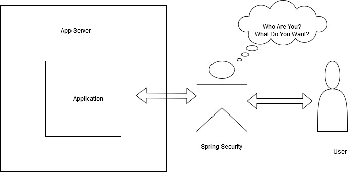
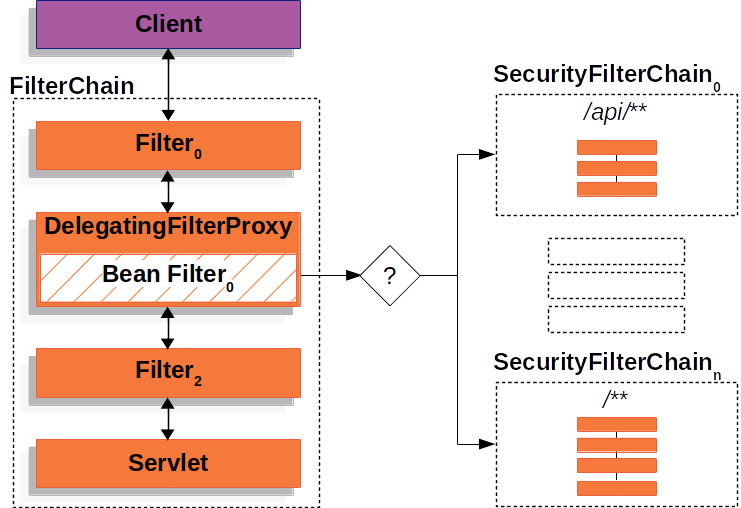
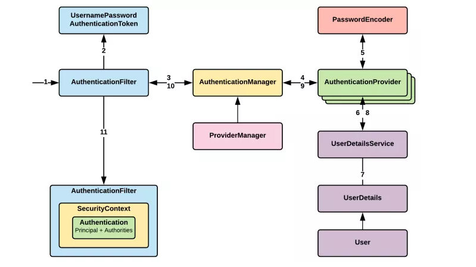
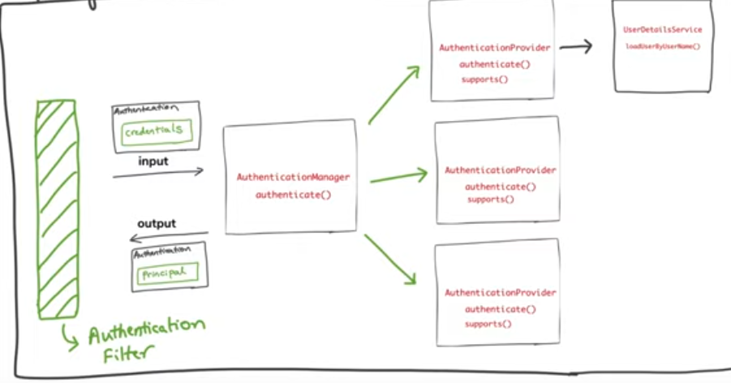
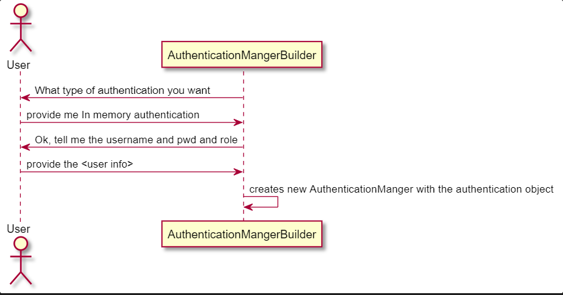
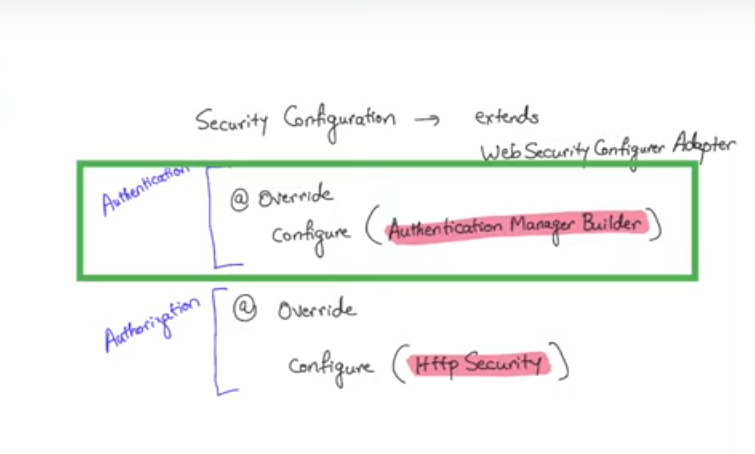

# Spring Security

Web applications are vulnerable to security threats because they are exposed to the open world of the Internet. Access to certain Web pages, files, or other classified resources must be restricted to authorized personnel only. Of course, there are several layers of security that are often applied, such as firewall, proxy server, JVM security, and so forth. 
But, to control access, there must be some security restriction at the **application level** as well. So we need security to secure our application from user like what they are allowed to do and what not. And moreover as Security threats are constantly evolving we need a way to secure our application. Therefore, **Spring Security**, a part of the Spring Framework, is only an advice or provision to apply a level of security at the application level.

As you probably know two major areas of application security are "authentication" and "authorization" (or "access-control"). These are the two main areas that Spring Security targets. "Authentication" is the process of establishing a principal, that is who they claim to be (a "principal" generally means a user, device or some other system which can perform an action in your application)."Authorization" refers to the process of deciding whether a principal is allowed to perform an action within your application. 

To arrive at the point where an authorization decision is needed, the identity of the principal has already been established by the authentication process. 

In simple terms consider spring security as a guard which you hire, who stands in front of your application and  intercept every incoming request that query your application and only allows it after successful authentication and based on authorization it decide whether request can perform action or not.




## Why Spring Security ?
* Login and logout functionality
* Allow/block access to URLs to logged in users
* Allow/block access to URLs to logged in users AND with certain roles
* Handles common vulnerablities (Session fixation, Clickjacking, Click site request forgery)
* widely adopted 
* Flexible and customizable

## What Spring Security can do ?
* User name/password authentication
* SSO/Okta/LDAP
* App level Authorization
* Intra App Authorization like OAuth
* Microservice security (using tokens, JWT)
* Method level security

## 5 Core concepts in spring security 
* Authentication ---- An application needs to know who is accessing the application. So authentication is related to word who. Application will check it by a login form. User will enter user name and password and these inputs will be validated by the application. Once the validation is successful, user is declared as authenticated.This information is called an authentication factor, and there are three types:
   * Knowledge factors. Factors the user must know in order to log in are considered a knowledge factor. This can be anything from a username, password, or pin number. The challenge with these factors is that they can be weak in terms of security because they can be shared or guessed.
   
   * Possession factors. Anything that the user must have in order to log in is known as a possession factor. One-time password tokens, key fobs, ID cards, and physical tokens are all considered possession factors.
   
   * Inheritance factors. Using a person’s biological characteristics is known as an inheritance factor. Any biometric authentication process, such as fingerprint scanning and face recognition, would fall into this category.

* Authorization ---- Authorization is to check whether user can access the application or not or what user can access and what user can not access.

* Principal --- The principal is the currently logged in user. However, you retrieve it through the security context which is bound to the current thread and as such it's also bound to the current request and its session. SecurityContextHolder.getContext() internally obtains the current SecurityContext implementation through a ThreadLocal variable. Because a request is bound to a single thread this will get you the context of the current request.

* Granted Authority --- Think of a GrantedAuthority as being a "permission" or a "right". Those "permissions" are (normally) expressed as strings (with the getAuthority() method).  Examples could include READ_AUTHORITY, WRITE_PRIVILEGE, or even CAN_EXECUTE_AS_ROOT. Those strings let you identify the permissions and let your voters decide if they grant access to something. When using a GrantedAuthority directly, such as through the use of an expression like hasAuthority(‘READ_AUTHORITY'), we are restricting access in a fine-grained manner.

* Roles --- Similarly, in Spring Security, we can think of each Role as a coarse-grained GrantedAuthority that is represented as a String and prefixed with “ROLE“. When using a Role directly, such as through an expression like hasRole(“ADMIN”), we are restricting access in a coarse-grained manner. It is worth noting that the default “ROLE” prefix is configurable.

## Spring Security default behaviour

* Adds mandatory authentication for URLs

* Adds Login form

* Handles login error

* Creates a user and sets a default password

## How Spring Security Works ?

So, how Spring Security bootstraps ?
 
 So we didn't invoke spring security, we didn't call its api. We add spring security as a dependency to our project and framework starts it. So how does framework do this ? 
 The answer is **Filters**

 Spring security build on chain of filters, which will intercept the request, detect (absence of) authentication, redirect to authentication entry point or pass the request to authorization service, and eventually let the request either hit the servlet or throw security exception (unauthenticated or unauthorized). 
 
 Spring Security maintains a filter chain internally where each of the filters has a particular responsibility and filters are added or removed from the configuration depending on which services are required. The ordering of the filters is important as there are dependencies between them. 
 
 When using servlet filters, you obviously need to declare them in your web.xml, or they will be ignored by the servlet container. In Spring Security, the filter classes are also Spring beans defined in the application context and thus able to take advantage of Spring’s rich dependency-injection facilities and lifecycle interfaces. Spring’s DelegatingFilterProxy provides the link between web.xml and the application context.
 
 **When using DelegatingFilterProxy, you will see something like this in the web.xml file:**
 
 ```
<filter>
 <filter-name>myFilter</filter-name>
 <filter-class>org.springframework.web.filter.DelegatingFilterProxy</filter-class>
</filter>

<filter-mapping>
 <filter-name>myFilter</filter-name>
 <url-pattern>/*</url-pattern>
</filter-mapping>
 
 ```
 
 But if you are using spring boot, it does this configuration for us by default.
 
 Notice that the filter is actually a DelegatingFilterProxy, and not the class that will actually implement the logic of the filter. What DelegatingFilterProxy does is delegate the Filter’s methods through to a bean(others filters) which is obtained from the Spring application context.
 
 The order that filters are defined in the chain is very important. Irrespective of which filters you are actually using, the order should be as follows:

* **ChannelProcessingFilter**, because it might need to redirect to a different protocol

* **SecurityContextPersistenceFilter**, so a SecurityContext can be set up in the SecurityContextHolder at the beginning of a web request, and any changes to the SecurityContext can be copied to the HttpSession when the web request ends (ready for use with the next web request)

* **ConcurrentSessionFilter**, because it uses the SecurityContextHolder functionality and needs to update the SessionRegistry to reflect ongoing requests from the principal

* **Authentication processing mechanisms** - UsernamePasswordAuthenticationFilter, CasAuthenticationFilter, BasicAuthenticationFilter etc - so that the SecurityContextHolder can be modified to contain a valid Authentication request token

* The **SecurityContextHolderAwareRequestFilter**, if you are using it to install a Spring Security aware HttpServletRequestWrapper into your servlet container

* The **JaasApiIntegrationFilter**, if a JaasAuthenticationToken is in the SecurityContextHolder this will process the FilterChain as the Subject in the JaasAuthenticationToken

* **RememberMeAuthenticationFilter**, so that if no earlier authentication processing mechanism updated the SecurityContextHolder, and the request presents a cookie that enables remember-me services to take place, a suitable remembered Authentication object will be put there

* **AnonymousAuthenticationFilter**, so that if no earlier authentication processing mechanism updated the SecurityContextHolder, an anonymous Authentication object will be put there

* **ExceptionTranslationFilter**, to catch any Spring Security exceptions so that either an HTTP error response can be returned or an appropriate AuthenticationEntryPoint can be launched

* **FilterSecurityInterceptor**, to protect web URIs and raise exceptions when access is denied


So consider **Filters** like cross-cutting concerns which intercept every requests and this gives opportunity to do something with each request.




## How does Spring Security do authentication?

So what the actual thing that does authentication in spring security, well there are several ways but one of the most common ways is through **Providers**. So there is a interface **AuthenticationProvider**. 
Spring security gives facility to define various **AuthenticationProvider** as per our need.
 So how does this different provider communicate or interact ? The answer is through **AuthenticationManager**

```
public interface AuthenticationProvider {

	Authentication authenticate(Authentication authentication)
			throws AuthenticationException;

	boolean supports(Class<?> authentication);

}
```
So we need an implementation of this interface and tells Spring Security about it and Spring Security will call this authenticate() method to authenticate users.

The most commonly used implementation of **AuthenticationManager** is **ProviderManager**, which delegates to a chain of **AuthenticationProvider** instances.




In a web application we can have multiple ways to authenticate (like sso, ldap), so a single app can have multiple authentication startegy, so as a result an application can have multiple **AuthenticationProvider**, each one knowing how to authenticate with specific mechanism.
There is a different ways to implement **AuthenticationManager** the common way to do is though **ProviderManager**. The ProviderManager does not do the work itself but it coordinates with all the AuthenticationProvider whichever supports the required authentication. Once it found the right AuthenticationProvider it delegates the work to that provider.

So how does ProviderManager finds out the right AuthenticationProvider the anser is using 

```
boolean supports(Class<?> authentication);

```
which AuthenticationProvider provides.


So for authentication , AuthenticationProvider needs user details which spring provide with the help of an implementation of **UserDetailService**




If all goes well, Spring Security creates a fully populated Authentication object (authenticate: true, granted authority list, and username), which will contain various necessary details. The Authentication object is stored in the SecurityContext in ThreadLocal object by the filter for future use.

## How to configure authentication in Spring Security ?

So, the entity which do the work of authentication in spring security is **AuthenticationManager** .
It attempts to authenticate the passed Authentication object, returning a fully populated Authentication object (including granted authorities) if successful. 
So we can think of an AuthenticationManager as an entity sitting inside spring security app and doing the authentication. It has one method authenticate 

```
public interface AuthenticationManager {

  Authentication authenticate(Authentication authentication)
    throws AuthenticationException;

}

```

An AuthenticationManager can do one of 3 things in its authenticate() method:

* return an Authentication (normally with authenticated=true) if it can verify that the input represents a valid principal.

* throw an AuthenticationException if it believes that the input represents an invalid principal.

* return null if it can’t decide.


So, we can not create instance of AuthenticationManager but we configure it using a helper class **AuthenticationManagerBuilder** through builder pattern.


So there are two steps here :

* Step 1: Get hold of AuthenticationManagerBuilder
* Step 2: Set the configuration on it

so when you are dealing with AuthenticationManagerBuilder , something like this happen




## So how do we get AuthenticationManagerBuilder object ?

So there is a class in spring security, name, **WebSecurityConfigurerAdapter** which has a method which takes **AuthenticationManagerBuilder** object.

```
 protected void configure(AuthenticationManagerBuilder auth){
 }
```
So spring security call this method and pass the AuthenticationManagerBuilder, so all we need to do is to extend this class and override this method, otherewise default authentication will be provided.

Other than this, it also provides other method to do customization for example if we need to authorize then this class is one we need to consult.




So, this covers a brief intoduction about spring security. For more you can refer, [spring-security](https://docs.spring.io/spring-security/site/docs/5.3.2.BUILD-SNAPSHOT/reference/html5/#servlet-authentication-securitycontextholder)


